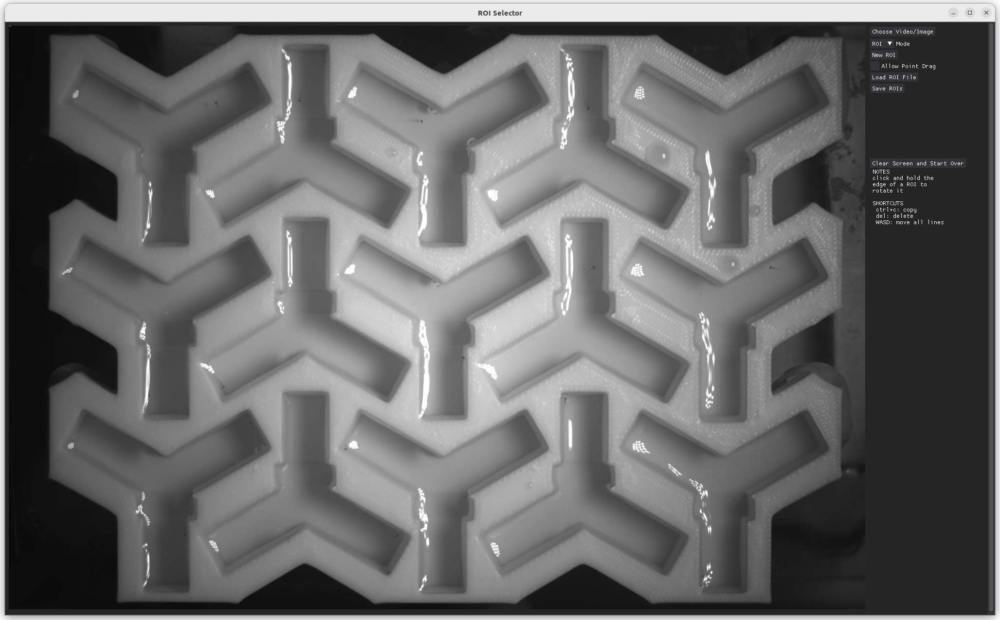

## About The Project

ROI and line selection of ROIs using DearPyGUI and Python. Can be overlayed on top of images, videos, or live camera feeds.

<!-- ROI Selection Screenshot -->



<!-- Line Selection Screenshot -->


### Installation

1. Install necessary packages
   ```sh
   pip install requirements.txt
   ```
2. Clone the repo
   ```sh
   git clone https://github.com/camden-cummings/roi_selector_dearpygui
   ```

## Usage
```sh
import dearpygui.dearpygui as dpg
from visibility_manager import VisibilityManager

dpg.create_context()

frame_width = 500
frame_height = 500

m = VisibilityManager("file_save_path", frame_width, frame_height)
while dpg.is_dearpygui_running():
    dpg.render_dearpygui_frame()
    
dpg.destroy_context()
```

## Acknowledgments

* Originally developed as an evolution of [this code]() in matplotlib, that implementation is linked [here]().
